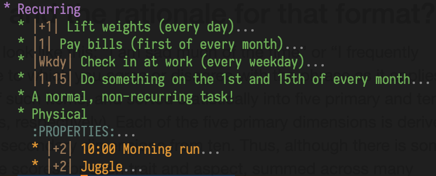

# org-recur

[](https://melpa.org/#/org-recur)
[](https://github.com/m-cat/org-recur/issues)
[](https://github.com/m-cat/org-recur)
[](https://opensource.org/licenses/GPL-3.0)

Recurring org-mode tasks.

<!-- markdown-toc start - Don't edit this section. Run M-x markdown-toc-refresh-toc -->
**Table of Contents**

- [org-recur](#org-recur)
    - [Screenshot](#screenshot)
    - [About](#about)
    - [Usage](#usage)
        - [Time of day](#time-of-day)
        - [Customizing weekdays](#customizing-weekdays)
        - ["First X of the month"](#first-x-of-the-month)
    - [Installing](#installing)
    - [Recommended Configuration](#recommended-configuration)
    - [Recommended org-mode settings](#recommended-org-mode-settings)
    - [Alternatives](#alternatives)
        - [Repeated tasks](#repeated-tasks)
        - [org-habit](#org-habit)
        - [Sexp diary entries](#sexp-diary-entries)

<!-- markdown-toc end -->


## Screenshot



## About

This package extends org-mode and org-agenda with support for defining recurring tasks and easily scheduling them.

I initially wrote this package for myself, because I've found that simple task management systems are the most effective for me. With this package I can just press `d` in the org-agenda to quickly reschedule a recurring chore -- neat! I hope that others happen to find this useful as well.

## Usage

By adding some simple syntax to anywhere in the task heading you can control how often the task should recur. Examples:

+ `|+2|`: Recur every other day.
+ `|+w|`: Recur every week.
+ `|1|`: Recur on the first of every month.
+ `|Thu|`: Recur every Thursday.
+ `|Sun,Sat|`: Recur every Sunday and Saturday.*
+ `|Wkdy|`: Recur every weekday.*

The syntax is the same as the one already used by `org-schedule`, with examples of additional syntax, provided by org-recur, marked by *.

You can use the provided command `org-recur-finish` to reschedule tasks based on their recurrence syntax. With the point over a task, in either org-mode or org-agenda, call `org-recur-finish` and it will handle the task intelligently. If the task does not contain a recurrence syntax, the command will ignore it by default, though this is customizable.

The provided command `org-recur-schedule-today` schedules a task to the current date.

### Time of day

org-recur supports time of day. It looks something like this: `|1 10:00, 15 12:00| headline`. It's a bit verbose, but you can specify different times of day for each date. If you don't want the verbosity you can move the time of day outside of org-recur: `|1, 15| 10:00 headline` works just fine, and is what I have been doing. org-agenda will pick up the time in either scenario.

### Customizing weekdays

You can customize the `org-recur-weekday-recurrence` variable to match your lifestyle. If a "weekday" (a day in which you work or study) for you includes Saturday, or excludes Wednesday, you can modify the variable accordingly.

### "First X of the month"

org-recur doesn't allow for something like "first Wednesday of the month". It only supports `org-schedule` syntax (which is its backend) as well as the ability to pick the *soonest* of several options. These unfortunately can't be combined for some more complicated recurrences.

For a possible alternative which allows for this, please see "Sexp diary entries" below and [here](https://stackoverflow.com/q/16946220/6085242) for an example.

## Installing

Make sure you have set up [MELPA](http://melpa.milkbox.net/#/getting-started) and run:

```
M-x package-install RET org-recur RET
```

Or, if you have [use-package](https://github.com/jwiegley/use-package):

```elisp
(use-package org-recur
  :demand t)
```

## Recommended Configuration

The following `use-package` configuration:

+ Enables `org-recur-mode` in org-mode files and `org-recur-agenda-mode` in the org-agenda.
+ Sets the suggested keybindings (`C-c d`, as well as `d` in `org-recur-agenda-mode`).
+ Enables `org-recur-finish` acting on headings without recurrence syntax, marking them done and archiving them.

```elisp
(use-package org-recur
  :hook ((org-mode . org-recur-mode)
         (org-agenda-mode . org-recur-agenda-mode))
  :demand t
  :config
  (define-key org-recur-mode-map (kbd "C-c d") 'org-recur-finish)

  ;; Rebind the 'd' key in org-agenda (default: `org-agenda-day-view').
  (define-key org-recur-agenda-mode-map (kbd "d") 'org-recur-finish)
  (define-key org-recur-agenda-mode-map (kbd "C-c d") 'org-recur-finish)

  (setq org-recur-finish-done t
        org-recur-finish-archive t))
```

## Recommended org-mode settings

Here are some org-mode settings that work well in conjunction with org-recur.

Refresh the org-agenda whenever a task is rescheduled:

```elisp
;; Refresh org-agenda after rescheduling a task.
(defun org-agenda-refresh ()
  "Refresh all `org-agenda' buffers."
  (dolist (buffer (buffer-list))
    (with-current-buffer buffer
      (when (derived-mode-p 'org-agenda-mode)
        (org-agenda-maybe-redo)))))

(defadvice org-schedule (after refresh-agenda activate)
  "Refresh org-agenda."
  (org-agenda-refresh))
```

Keep the task metadata clean:

```elisp
;; Log time a task was set to Done.
(setq org-log-done (quote time))

;; Don't log the time a task was rescheduled or redeadlined.
(setq org-log-redeadline nil)
(setq org-log-reschedule nil)
```

Prefer rescheduling to future dates and times:

```elisp
(setq org-read-date-prefer-future 'time)
```

## Alternatives

### Repeated tasks

org-mode already supports ["repeated tasks"](https://orgmode.org/manual/Repeated-tasks.html), but it has some shortcomings:

+ Tasks need to have a TODO status set. I have a *lot* of recurring tasks and I don't want them all to be TODO.
+ You can't see how often a task recurs from the org-agenda view, you only see the task's headline and not its `SCHEDULED`/`DEADLINE` timestamps.
+ Repeated tasks require the `.+` syntax to shift the date based on today, which is what I almost always want. If I want to schedule a `+2` task to tomorrow I can do that manually, but I still want it to be clear that the task should recur every two days.

org-recur is also simpler. I want to think as little as possible when I organize my time, helping  keep my personal time management frictionless.

### org-habit

[org-habit](https://orgmode.org/manual/Tracking-your-habits.html) is similar to org-recur and has some interesting, albeit unnecessary features. The same drawbacks apply as above; in addition, org-recur is much simpler.

### Sexp diary entries

You can also get some features of org-recur using [Diary-style sexp entries](https://orgmode.org/guide/Timestamps.html). For example, you can get the `|1,15|` recurrence with `SCHEDULED: <%%(diary-date t '(1 15) 2019)>` (see `C-h f diary-date`).

The biggest shortcoming of this approach, it seems to me, is the complexity of it. You also can't see the timestamp from the org-agenda view.
